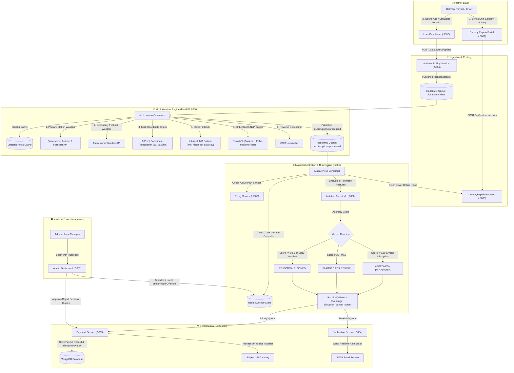

# 🛵 RideShield — Complete Architecture, Flowchart & Feature Master Guide

---

## 📑 Table of Contents
1. [End-to-End System Flowchart & Visual Architecture](#1-end-to-end-system-flowchart--visual-architecture)
2. [Platform Overview & Core Persona](#2-platform-overview--core-persona)
3. [Insurance Plans & Pricing Tiers](#3-insurance-plans--pricing-tiers)
4. [Dynamic Weekly Pricing (XGBoost ML Engine)](#4-dynamic-weekly-pricing-xgboost-ml-engine)
5. [Dual Weather APIs & Multi-Coordinate Triangulation](#5-dual-weather-apis--multi-coordinate-triangulation)
6. [Social Disruptions, Bandhs, Curfews & Strike Detection](#6-social-disruptions-bandhs-curfews--strike-detection)
7. [Datasets Used Across the Platform](#7-datasets-used-across-the-platform)
8. [Compensation Calculation Engine](#8-compensation-calculation-engine)
9. [AI & Machine Learning Suite (3 Models)](#9-ai--machine-learning-suite-3-models)
10. [Anti-Fraud & Telemetry Verification Engine (8 Signals)](#10-anti-fraud--telemetry-verification-engine-8-signals)
11. [Decision Verdicts & Manual Review Workflow](#11-decision-verdicts--manual-review-workflow)
12. [Admin Dashboard & Zone Manager Overrides](#12-admin-dashboard--zone-manager-overrides)
13. [Microservices & Distributed Tech Stack](#13-microservices--distributed-tech-stack)
14. [Deep Dive: Core Infrastructure — Why & How Each Technology is Used](#14-deep-dive-core-infrastructure--why--how-each-technology-is-used)

---

## 1. End-to-End System Flowchart & Visual Architecture

### A. Universal Visual Flowchart (PDF & Print Compatible)

```
┌──────────────────────────────────────────────────────────────────────────────────────────────────┐
│                                   🚗 PARTNER / DRIVER LAYER                                      │
│                                                                                                  │
│   ┌──────────────────────────────────────────────┐  ┌─────────────────────────────────────────┐  │
│   │   Dummy Rapido Portal (Port 3001)            │  │   User Dashboard (Port 3000)            │  │
│   │   • Logs hourly online slots & accepted rides│  │   • Live disruption monitor & simulate  │  │
│   └──────────────────────┬───────────────────────┘  └────────────────────┬────────────────────┘  │
└──────────────────────────┼───────────────────────────────────────────────┼───────────────────────┘
                           │ POST /api/partners/activity                   │ POST /api/address/update
                           ▼                                               ▼
┌───────────────────────────────────────────────────┐ ┌────────────────────────────────────────────┐
│      DummyRapido Backend (Port 5000)              │ │     Address Polling Service (Port 5004)    │
│      • Persists shift activity in MongoDB         │ │     • Ingests coordinates & geocodes       │
└───────────────────────────────────────────────────┘ └────────────────────┬───────────────────────┘
                                                                           │ Publishes payload
                                                                           ▼
                                                      ┌────────────────────────────────────────────┐
                                                      │  RABBITMQ QUEUE: location.update           │
                                                      └────────────────────┬───────────────────────┘
                                                                           │ Consumes coordinates
                                                                           ▼
┌──────────────────────────────────────────────────────────────────────────────────────────────────┐
│                                🤖 ML & WEATHER SERVICE (FastAPI :8000)                           │
│                                                                                                  │
│   1. Checks Redis Cache (disruptions:date:lat_lng) ──→ Cache HIT (Skip API)                      │
│   2. Multi-Coordinate Triangulation (lat, lat + 2km, lat - 2km)                                  │
│   3. Primary Weather API: Open-Meteo Archive / Station Records                                    │
│   4. Secondary Fallback API: Tomorrow.io Hourly Weather                                          │
│   5. Strike & Bandh NLP Engine: NewsAPI (Boolean + False-Positive Filter)                        │
│   6. Offline Fallback: Local IMD Historical Weather Dataset                                      │
└──────────────────────────────────────────────────┬───────────────────────────────────────────────┘
                                                   │ Publishes detected disruptions
                                                   ▼
┌──────────────────────────────────────────────────────────────────────────────────────────────────┐
│                            RABBITMQ QUEUE: ml.disruptions.processed                              │
└──────────────────────────────────────────────────┬───────────────────────────────────────────────┘
                                                   │ Consumes disruption event
                                                   ▼
┌──────────────────────────────────────────────────────────────────────────────────────────────────┐
│                                ⚙️ MAIN ENGINE & RISK SCORING (:5005)                             │
│                                                                                                  │
│   • Policy Check: Queries PolicyService (:5002) for active plan & daily protected wage (₹600)    │
│   • Shift Sync: Queries DummyRapido (:5000) for driver online shift slots                        │
│   • Override Check: Checks Redis for manual Zone Manager flood/strike overrides                  │
│   • Telemetry Anti-Fraud: Isolation Forest ML evaluates 8 device signals (Speed, Drift, IP)      │
│                                                                                                  │
│                     ┌─────────────────────────────────────────────────────┐                      │
│                     │             ISOLATION FOREST DECISION TREE          │                      │
│                     │  • Anomaly Score < 0.30  ──→ APPROVED / PROCESSED   │                      │
│                     │  • Anomaly Score 0.30-0.55 ──→ REVIEW (Admin Hold)  │                      │
│                     │  • Anomaly Score >= 0.55 ──→ REJECTED (Fraud Alert) │                      │
│                     └──────────────────────────┬──────────────────────────┘                      │
└────────────────────────────────────────────────┼─────────────────────────────────────────────────┘
                                                 │ Publishes to Fanout Exchange
                                                 ▼
┌──────────────────────────────────────────────────────────────────────────────────────────────────┐
│                          RABBITMQ FANOUT: disruption_payout_fanout                               │
│                          (Broadcasts simultaneously to 2 queues in parallel)                     │
└────────────────────────┬─────────────────────────────────────────────────┬───────────────────────┘
                         │                                                 │
                         │ Priority Routing (Pro Plan: Priority 10)        │ Standard Routing
                         ▼                                                 ▼
┌───────────────────────────────────────────────────┐ ┌────────────────────────────────────────────┐
│ RABBITMQ QUEUE: payment.disruption_priority       │ │ RABBITMQ QUEUE: notification.disruption    │
└────────────────────────┬──────────────────────────┘ └────────────────────┬───────────────────────┘
                         │ (Consumes)                                      │ (Consumes)
                         ▼                                                 ▼
┌───────────────────────────────────────────────────┐ ┌────────────────────────────────────────────┐
│           PAYMENT SERVICE (Port 5003)             │ │       NOTIFICATION SERVICE (Port 3004)     │
│                                                   │ │                                            │
│   • Checks Idempotency Key (payout:userId:date)   │ │   • Formats HTML email template            │
│   • Writes Payout Document to MongoDB             │ │   • Dispatches realtime alert to driver    │
│   • Simulates Instant Stripe / UPI Transfer       │ │     via SMTP Server                        │
└───────────────────────────────────────────────────┘ └────────────────────────────────────────────┘
                         │
                         ▼
┌──────────────────────────────────────────────────────────────────────────────────────────────────┐
│                                   🛡️ ADMIN / ZONE MANAGER LAYER                                  │
│                                                                                                  │
│   ┌──────────────────────────────────────────────────────────────────────────────────────────┐   │
│   │   Admin Dashboard (Port 3002)                                                            │   │
│   │   • Passcode Security Guard (ADMIN_PASSCODE header injection)                            │   │
│   │   • Manual Review Queue: Approve/Reject escrow claims flagged by Isolation Forest        │   │
│   │   • Zone Manager Overrides: Pushes confirmed-social:date:zone to Redis (7-day TTL)       │   │
│   └──────────────────────────────────────────────────────────────────────────────────────────┘   │
└──────────────────────────────────────────────────────────────────────────────────────────────────┘
```

---

### B. Mermaid Flowchart (For Web & Interactive Markdown Viewers)



---

## 2. Platform Overview & Core Persona

*   **Platform Goal:** Provide zero-touch, automated parametric income insurance for gig-economy delivery captains (e.g., Rapido, Uber Moto, Swiggy/Zomato delivery partners).
*   **Persona:** Two-wheeler delivery drivers whose daily wages drop drastically during environmental or civil disruptions (heavy rain, waterlogging, severe pollution, strikes).
*   **Zero-Touch Philosophy:** Drivers do not file claims, upload receipts, or wait for manual surveyors. The system continuously listens to parametric triggers, cross-references driver activity logs, calculates wage loss, and triggers instant payouts.

---

## 3. Insurance Plans & Pricing Tiers

RideShield offers 3 subscription tiers tailored to gig workers:

| Plan | Weekly Base Premium | Covered Disruption Triggers | Daily Protected Wage | Weekly Cap | Features |
| :--- | :---: | :--- | :---: | :---: | :--- |
| **Basic** | **₹20 / week** | • Heavy Rain<br>• Extreme Heat | ₹400 / day | ₹400 | Affordable entry tier for weather coverage |
| **Standard** | **₹35 / week** | • Heavy Rain<br>• Extreme Heat<br>• Hazardous AQI (Pollution)<br>• Strikes, Bandhs & Curfews | ₹600 / day | ₹600 | Full environmental & social disruption coverage |
| **Pro / Pro Shield** | **₹49 / week** | • Heavy Rain<br>• Extreme Heat<br>• Hazardous AQI (Pollution)<br>• Strikes, Bandhs & Curfews<br>• Floods & Local Waterlogging | ₹800 / day | ₹800 | **Instant Priority Queue Settlement** (`x-max-priority: 10`) |

---

## 4. Dynamic Weekly Pricing (XGBoost ML Engine)

Every **Monday at 5:00 AM IST**, an automated cron job in `MainService` calculates dynamic premiums for all registered drivers based on their assigned city/village zone.

### How it Works:
1. **Historical & Forecast Weather Ingestion:** The ML service pulls 7-day weather predictions for the driver's registered pincode/village from Open-Meteo.
2. **XGBoost Regressor Model:** Trained on historical disruption frequency, rainfall intensity, and seasonal flood indicators.
3. **Risk Surcharge / Discount Logic:**
   * **High Risk Zone (Monsoon / Frequent Storms):** Base premium + Surcharge (e.g., ₹35 base $\rightarrow$ ₹42/week).
   * **Low Risk Zone (Clear Forecast):** Base premium - Weather Discount (e.g., ₹35 base $\rightarrow$ ₹30/week).
   * **Base Rate:** Retains standard ₹20 / ₹35 / ₹49 rate if risk is normal.
4. **Transparency in UI:** The driver's dashboard explains the dynamic calculation (e.g., *"+₹7 Monsoon Surcharge applied based on 7-day heavy precipitation forecast for Vijayawada Zone"*).

---

## 5. Dual Weather APIs & Multi-Coordinate Triangulation

To ensure zero downtime and prevent missing hyper-local micro-burst rainstorms, RideShield uses a **Dual-API with Coordinate Triangulation Architecture**:

```
                              ┌──────────────────────────────────────────────┐
                              │  Disruption Check for Lat: 16.51, Lng: 80.64 │
                              └──────────────────────┬───────────────────────┘
                                                     │
                     ┌───────────────────────────────┼───────────────────────────────┐
                     ▼                               ▼                               ▼
       Point 1: Exact Driver GPS       Point 2: Lat + 2km North         Point 3: Lat - 2km South
       (Lat: 16.51, Lng: 80.64)        (Lat: 16.53, Lng: 80.64)         (Lat: 16.49, Lng: 80.64)
                     │                               │                               │
                     └───────────────────────┬───────┴───────────────────────────────┘
                                             ▼
                             ┌───────────────────────────────┐
                             │  Primary API: Open-Meteo      │
                             │  (Archive / Station Records)  │
                             └───────────────┬───────────────┘
                                             │ (If Failed or Rate Limited)
                                             ▼
                             ┌───────────────────────────────┐
                             │  Secondary API: Tomorrow.io   │
                             │  (Hourly Precipitation Feed)  │
                             └───────────────┬───────────────┘
                                             │ (If Both Offline)
                                             ▼
                             ┌───────────────────────────────┐
                             │  Static IMD Historical CSV    │
                             │  (Local Zone Weather Backup)  │
                             └───────────────────────────────┘
```

### 1. Primary API: Open-Meteo Archive & Forecast API
*   Queries actual physical weather stations for the exact date and coordinate.
*   Pulls 24-hour arrays for `precipitation` (mm/hr) and `temperature_2m` (°C).

### 2. Secondary API: Tomorrow.io API
*   If Open-Meteo fails or hits HTTP 429/500 limits, the system triggers a fallback call to `https://api.tomorrow.io/v4/weather/forecast` with the driver's coordinates.

### 3. 3-Point Coordinate Triangulation (Hyper-Local Detection)
*   Indian monsoon rain often falls heavily in one street while 2 km away is completely dry.
*   RideShield queries 3 coordinates simultaneously: `(lat, lng)`, `(lat + 2km, lng)`, and `(lat - 2km, lng)`.
*   The system takes the **maximum precipitation** across all 3 points, protecting the driver from being denied compensation due to GPS station offset.

### 4. Third-Layer Fallback: Local IMD Dataset
*   If internet connectivity is completely lost, the system falls back to `imd_historical_data.csv` to supply statistical regional averages.

---

## 6. Social Disruptions, Bandhs, Curfews & Strike Detection

### A. Real-Time News NLP Engine (`news_service.py`)
RideShield integrates **NewsAPI** to automatically detect city-wide shutdowns, strikes, bandhs, and curfews:

1. **Boolean News Query:**
   ```
   (strike OR curfew OR bandh OR hartal OR shutdown OR blockade) AND "{city}"
   ```
2. **False-Positive Noise Filtering:**
   To avoid false triggers from non-transportation news, the NLP engine scans the article title and description with an exclusion regex:
   *   *Excluded:* Military strikes, missile strikes, air strikes, hunger strikes, metaphorical phrases (*"strike a deal"*, *"strike gold"*, *"lightning strike"*).
   *   *Retained:* Auto-rickshaw strikes, delivery agent walkouts, transport union strikes, political bandhs, Section 144 curfews.
3. **Severity Classification:**
   *   **`heavy` Disruption:** Triggered if keywords include `curfew`, `bandh`, `hartal`, or `shutdown` (treated as a full-day disruption).
   *   **`medium` Disruption:** Triggered for general transport union strikes.

### B. Zone Manager Redis Overrides (Immediate Human Ground-Truth)
*   If an unannounced, sudden local protest or road blockage occurs before news agencies publish articles, the on-ground Zone Manager opens the **Admin Dashboard (:3002)** and submits a **Disruption Override**.
*   This writes a key to Upstash Redis: `confirmed-social:{date}:{zone}` with a 7-day TTL.
*   The `MainService` instantly factors this override into all active driver calculations in that zone.

---

## 7. Datasets Used Across the Platform

RideShield incorporates three primary datasets to train its ML models and provide offline fallback resilience:

### 1. `imd_historical_data.csv` (IMD & Social Risk Dataset)
*   **Source:** Indian Meteorological Department (IMD) historical records + State Transport disruption records.
*   **Columns:**
    ```csv
    district,state,avg_rain_days_per_month,flood_zone_classification,avg_aqi_score_last_year,strike_events_last_2_years,zone_type,monsoon_season_flag,risk_label
    ```
*   **Usage:** Trains the **Random Forest Classifier** to assign baseline risk tiers (Low/Medium/High) to Indian districts.

### 2. `xgboost_premium_training_data` (Dynamic Pricing Dataset)
*   **Features:** Historical weekly precipitation, 7-day rainfall variance, temperature extremes, season index, past claims volume.
*   **Usage:** Trains the **XGBoost Regressor** to predict dynamic price adjustments every Monday.

### 3. Synthetic Telemetry Baseline (`isolation_forest_telemetry`)
*   **Features:** Multi-dimensional device telemetry samples (velocity, accelerometer standard deviation, cell tower delta, ping intervals).
*   **Usage:** Establishes the baseline cluster for normal delivery driving vs. emulator bot signatures.

---

## 8. Compensation Calculation Engine

$$ \text{Hourly Rate} = \frac{\text{Daily Wage Protection (e.g., ₹600)}}{\text{Standard Working Hours (8 hours)}} = ₹75.00/\text{hr} $$

$$ \text{Compensation Payout} = \text{Overlap Hours}(\text{Disrupted Hours} \cap \text{Driver Online Slots}) \times \text{Hourly Rate} $$

### Trigger Thresholds:
*   🌧️ **Rain:** $\ge 0.5\text{ mm/hr}$
*   🌡️ **Heat:** $\ge 45^\circ\text{C}$
*   🌫️ **AQI:** $> 300\text{ AQI}$ (Hazardous)
*   🛑 **Bandh / Curfew / Strike:** Active confirmed keyword match or Zone Manager Redis key.

---

## 9. AI & Machine Learning Suite (3 Models)

```
┌───────────────────────────────────┬───────────────────────────────┬──────────────────────────────────────────────────────┐
│ Model Name                        │ Algorithm                     │ Purpose & Execution                                  │
├───────────────────────────────────┼───────────────────────────────┼──────────────────────────────────────────────────────┤
│ 1. Dynamic Pricing Engine         │ XGBoost Regressor             │ Runs every Monday at 5:00 AM to price weekly premium │
│ 2. Zone Risk Classifier           │ Random Forest Classifier      │ Classifies districts into Low / Medium / High risk   │
│ 3. Telemetry Anti-Fraud Engine    │ Isolation Forest (Unsupervised│ Evaluates 8 device signals to block spoofing in <1s  │
└───────────────────────────────────┴───────────────────────────────┴──────────────────────────────────────────────────────┘
```

---

## 10. Anti-Fraud & Telemetry Verification Engine (8 Signals)

1.  **Velocity Divergence:** Blocks teleportation (distance between pings requiring $> 120\text{ km/h}$).
2.  **Telemetry / Vibration Variance:** Real motorbikes generate accelerometer road noise; GPS emulators generate flat-lines.
3.  **Cell Tower vs. GPS Coherence:** Checks if mobile network LAC/CID tower matches the reported GPS coordinate.
4.  **IP Geolocation Region Match:** Validates network ISP region against coordinate city.
5.  **Dummy Rapido API Shift Sync:** Confirms driver was marked online on the partner delivery platform.
6.  **Future Time Protection:** Discards pings for hours that have not yet occurred in IST.
7.  **Idempotency Locks:** `payout:userId:date` key in Redis prevents duplicate claims.
8.  **Multi-Pincode Hopping Flag:** Flags accounts claiming payouts across disjoint cities within 2 hours.

---

## 11. Decision Verdicts & Manual Review Workflow

```
┌─────────────────────────┬───────────────────────────┬──────────────────────────────────────────┐
│ Anomaly Score           │ Status                    │ System Action                            │
├─────────────────────────┼───────────────────────────┼──────────────────────────────────────────┤
│ Score < 0.30            │ PROCESSED / APPROVED      │ Automated payout dispatched via UPI/Bank │
│ 0.30 <= Score < 0.55    │ REVIEW                    │ Escrow hold; routed to Admin Review      │
│ Score >= 0.55           │ REJECTED / FLAGGED        │ Blocked by ML Risk Engine (Fraud Alert)  │
└─────────────────────────┴───────────────────────────┴──────────────────────────────────────────┘
```

*   **Review Flow:** If flagged for `REVIEW`, the claim appears in the **Admin Review Queue**. The Zone Manager views the shift log, weather overlay, and accelerometer variance, and clicks **Approve** or **Reject**.

---

## 12. Admin Dashboard & Zone Manager Overrides

*   **Access Control:** Passcode protection verified via `ADMIN_PASSCODE` and `x-admin-token` HTTP header.
*   **Live Active Disruption Monitor:** Real-time map & zone status.
*   **Manual Overrides:** Pushes `confirmed-social:{date}:{zone}` to Redis with 7-day TTL, immediately triggering payouts for all active drivers in that zone.

---

## 13. Microservices & Distributed Tech Stack

```
╔══════════════════════════════════════════════════════════════════════════════════════════════╗
║                                RIDESHIELD TECH STACK                                         ║
╠══════════════════════╦══════════════════════╦════════════════════════════════════════════════╣
║ Layer                ║ Technology           ║ Details & Usage                                ║
╠══════════════════════╬══════════════════════╬════════════════════════════════════════════════╣
║ Frontend Apps (3)    ║ React.js 18 + Vite   ║ User Dashboard (:3000), Partner (:3001), Admin ║
║ Styling & Animation  ║ TailwindCSS + Motion ║ Dark mode glassmorphism, responsive UI         ║
║ Backend Services (8) ║ Node.js + Express    ║ Modular microservices mesh (:5000 to :5005)    ║
║ Machine Learning (1) ║ Python 3.11 + FastAPI║ Port 8000 (XGBoost, Scikit-Learn, Pandas)      ║
║ Message Queue        ║ RabbitMQ (CloudAMQP) ║ Pub/Sub Fanout & Priority Queues               ║
║ In-Memory Cache      ║ Upstash Redis        ║ Sub-50ms session store, locks, manager override║
║ Primary Database     ║ MongoDB Atlas        ║ Persistent storage for policies, users, payouts║
║ Payment Simulation   ║ Stripe SDK + Webhooks║ Automated parametric money transfers           ║
║ Email Notifications  ║ Nodemailer / SMTP    ║ Real-time disruption & approval notifications  ║
╚══════════════════════╩══════════════════════╩════════════════════════════════════════════════╝
```

---

## 14. Deep Dive: Core Infrastructure — Why & How Each Technology is Used

### 🐇 1. RabbitMQ (CloudAMQP) — Distributed Event Broker

```
                                  ┌───────────────────────────┐
                                  │   Address Polling (:5004) │
                                  └─────────────┬─────────────┘
                                                │ (Publishes)
                                                ▼
                               ┌─────────────────────────────────┐
                               │     Queue: location.update      │
                               └────────────────┬────────────────┘
                                                │ (Consumes)
                                                ▼
                                  ┌───────────────────────────┐
                                  │     ML-Service (:8000)    │
                                  └─────────────┬─────────────┘
                                                │ (Publishes)
                                                ▼
                               ┌─────────────────────────────────┐
                               │  Queue: ml.disruptions.processed│
                               └────────────────┬────────────────┘
                                                │ (Consumes)
                                                ▼
                                  ┌───────────────────────────┐
                                  │    MainService (:5005)    │
                                  └─────────────┬─────────────┘
                                                │ (Publishes to Fanout)
                                                ▼
                      ┌───────────────────────────────────────────────────┐
                      │    Fanout Exchange: disruption_payout_fanout      │
                      └─────────────┬───────────────────────┬─────────────┘
                                    │                       │
                                    ▼                       ▼
                     ┌─────────────────────────────┐ ┌─────────────────────────────┐
                     │ payment.disruption_priority │ │    notification.disruption  │
                     │ (Priority Queue: max 10)    │ │    (Standard Queue)         │
                     └──────────────┬──────────────┘ └──────────────┬──────────────┘
                                    │ (Consumes)                    │ (Consumes)
                                    ▼                               ▼
                      ┌────────────────────────────┐ ┌─────────────────────────────┐
                      │   Payment Service (:5003)  │ │ Notification Service (:3004)│
                      └────────────────────────────┘ └─────────────────────────────┘
```

#### Why RabbitMQ?
1. **Traffic Spike Buffering:** During a sudden city-wide storm, 10,000 drivers ping coordinates simultaneously. Without a queue, direct HTTP calls would overwhelm the ML Service and MongoDB. RabbitMQ acts as a shock absorber, queuing messages and letting consumers process them at a steady rate.
2. **Decoupled Asynchronous Processing:** The driver's app does not have to wait for weather lookups or ML calculations. It gets an immediate `200 OK` from `AddressPolling`, while RabbitMQ processes the heavy computation in the background.
3. **Pub/Sub Fanout Routing:** When a claim is processed, `MainService` broadcasts the event once to `disruption_payout_fanout`. RabbitMQ automatically clones the message into both `payment.disruption_priority` and `notification.disruption` in parallel without coupling the services.
4. **Priority Queues (`x-max-priority: 10`):** Pro / Pro Shield users have their payout events published with `priority: 10`. RabbitMQ pushes them to the front of the queue ahead of standard users, ensuring instant settlement.
5. **Zero-Message-Loss Durability:**
   * Queues declared with `durable: true` (survives broker restart).
   * Messages published with `persistent: true` (written to disk).
   * Explicit `channel.ack(msg)` ensures messages are only deleted after successful database writes.

---

### ⚡ 2. Upstash Redis — In-Memory Cache & Distributed Lock Engine

#### Why Redis?
1. **API Rate-Limit Protection & Sub-50ms Speeds:** Calling Open-Meteo or NewsAPI for every driver ping would exhaust API rate limits instantly. Redis caches weather responses in RAM, dropping response times to under 5ms on cache hits.
2. **Distributed Idempotency Locks:** Prevents double-payouts when RabbitMQ redelivers messages or when users simulate multiple locations.
3. **Live Ground-Truth Overrides:** Provides a lightning-fast key-value store for Zone Manager manual disruption declarations.

#### Exact Redis Key Schemas & TTLs:
*   **Weather Cache:** `disruptions:{date}:{lat}_{lng}` — TTL: `1800s` (30 minutes). If 100 drivers are in the same zone, only 1 external API call is made; the other 99 read directly from Redis.
*   **Idempotency Lock:** `payout:{userId}:{date}` — TTL: `86400s` (24 hours). Uses atomic `SET key value EX 86400 NX` (set-if-not-exists). If a duplicate event arrives, Redis rejects it and stops double-payouts.
*   **Zone Manager Overrides:** `confirmed-social:{date}:{zone}` — TTL: `604800s` (7 days). Stores manual flood/strike flags set by admins.
*   **Driver GPS Cache:** `worker:{userId}:location` — Stores latest reported driver coordinate for rapid geofence lookups.

---

### 🍃 3. MongoDB Atlas — Persistent Document Store

#### Why MongoDB?
1. **Document-Oriented Schema:** Insurance policies, hourly shift logs (with 24 nested slot objects), and disruption arrays are hierarchical JSON structures. MongoDB stores them natively as BSON without complex SQL relational joins.
2. **Horizontal Scalability:** Handles high-volume write operations when thousands of payout transactions are logged simultaneously.

#### Collections & Structure:
*   `users` (`AuthService` :5001): Stores driver credentials, hashed passwords, vehicle type, and registered home city/village.
*   `policies` (`PolicyService` :5002): Stores active subscription plans, premium paid, daily protected wage, and dynamic pricing history.
*   `disruption_payouts` (`PaymentService` :5003): Stores historical claim records, compensation amount, disrupted hours, rejection reasons, and payout status (`PROCESSED`, `REVIEW`, `REJECTED`).
*   `partner_logs` (`DummyRapido` :5000): Stores daily 24-hour partner shift activity (`hourlyActivity: [{ timeSlot, isOnline, ridesAccepted }]`).

---

### 💳 4. Stripe SDK & UPI Gateway Simulation

#### Why Stripe & Webhooks?
1. **Production-Ready Payment Workflows:** Emulates real-world payment intent creation, customer balance debiting, and webhook notifications.
2. **Automated Weekly Billing:** Manages weekly subscription renewals every Monday.
3. **Instant Payout Triggering:** Simulates direct automated transfers to driver bank accounts or UPI VPA handles upon claim approval.

---

### 📬 5. Nodemailer / SMTP Notification Service

#### Why a Dedicated Notification Microservice?
1. **Non-Blocking Email Ingestion:** Sending emails over SMTP takes 1–3 seconds. Decoupling it into a dedicated microservice listening to `notification.disruption` ensures that slow mail servers never delay payment processing.
2. **Automated Status Templates:** Dispatches rich HTML emails explaining the payout breakdown (e.g. *"₹225.00 credited for 3 hours of rain disruption on your shift"*).

---

### 🐍 6. Python FastAPI ML Service (:8000)

#### Why FastAPI with Python?
1. **Native ML Library Ecosystem:** Houses `scikit-learn`, `xgboost`, `pandas`, and `numpy` in a single runtime.
2. **High-Performance Asynchronous Endpoints:** Powered by Starlette and Uvicorn, delivering sub-millisecond JSON serialization for ML inference.
3. **Dual Role:** Runs the REST inference endpoints (`/api/ml/disruptions`, `/api/ml/fraud-check`, `/api/ml/dynamic-pricing`) while concurrently running an asynchronous background RabbitMQ consumer thread (`location_consumer.py`).

---
*RideShield — Automated Parametric Income Insurance System*
